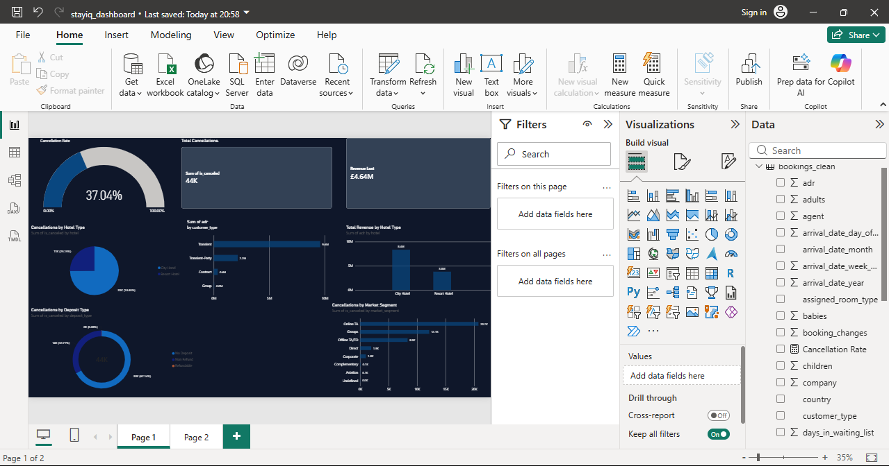

# StayIQ — Hotel Booking Revenue & Cancellation Intelligence

An end-to-end data analytics project identifying why hotels lose revenue to booking cancellations, and which customer segments, deposit policies, and booking channels drive that risk.

## Business Problem

Hotel cancellations are a silent revenue leak. A booking that looks confirmed can vanish days before check-in, leaving rooms empty and revenue unrecovered. Using 119,390 real hotel bookings, this project quantifies exactly how much revenue is at risk, which hotel type and customer segments cancel most, and what operational changes (deposit policy, lead-time monitoring, channel focus) could reduce that risk.

## What I Built

A full pipeline from raw data to a decision-ready dashboard:

- Cleaned and loaded 119,390 booking records into a SQLite database
- Answered 7 core business questions using SQL (aggregation, grouping, filtering, calculated fields)
- Built an interactive Power BI dashboard with DAX measures, cross-filtering, and a hotel-type slicer for drill-down analysis
- Delivered concrete, data-backed business recommendations

## Key Findings

1. **Overall cancellation rate is 37.04%** — out of 119,390 bookings, 44,224 were cancelled.
2. **City Hotel cancels far more than Resort Hotel.** City Hotel: 41.73% (33,102 of 79,330 bookings). Resort Hotel: 27.76% (11,122 of 40,060 bookings). City Hotel cancels at roughly 1.5x the rate of Resort Hotel.
3. **£4,641,942.67 in revenue was lost to cancellations** (based on nightly rate, ADR, across all cancelled bookings).
4. **Cancelled bookings are booked much further in advance.** Average lead time for cancelled bookings: 144.8 days. Average lead time for completed bookings: 80.0 days — nearly double. Long lead time is a measurable early-warning signal for cancellation risk.
5. **"Non Refund" deposits show a 99.36% cancellation rate** — the highest of any deposit type, and counter-intuitive on its face (14,494 of 14,587 bookings cancelled). This is flagged as a data anomaly rather than a clean insight — see Limitations.
6. **Group bookings cancel at 61.06%**, more than double the rate of Online Travel Agent bookings (36.72%) and over 4x Direct bookings (15.34%). Group bookings are the highest-risk market segment by a wide margin.
7. **Transient customers generate the most revenue by far** (£9,589,811.59), more than 4x Transient-Party (£2,162,780.78) and dwarfing Contract (£356,852.32) and Group (£48,172.91) — despite Group being the highest-cancellation segment. This is the customer base most worth protecting.

## Business Recommendations

1. **Introduce a graduated deposit policy for City Hotel bookings**, where cancellation rates are 50% higher than Resort Hotel — a flat policy across both properties leaves money on the table.
2. **Flag bookings with lead times beyond ~110 days for proactive follow-up** (confirmation calls, reminder emails, or a soft deposit request), since long lead time is the single clearest early signal of cancellation risk found in this data.
3. **Reassess deposit terms for Group bookings specifically.** At 61.06% cancellation, Groups are the highest-risk segment — yet typically the segment hotels are most eager to secure with lenient terms.
4. **Investigate the "Non Refund" anomaly before acting on it.** A 99.36% cancellation rate on non-refundable bookings suggests a data or booking-process issue (e.g., cancellations that aren't actually being charged, or a data entry pattern) — this needs an operational conversation, not a policy change, until it's understood.
5. **Protect the Transient customer relationship above all else.** It drives the majority of revenue outright — service quality and retention effort should weight here first.
6. **Treat Online Travel Agent and Offline Travel Agent/Tour Operator channels as the volume core, not the risk problem.** Their cancellation rates (36.72% and 34.32%) sit close to the overall average — the real outliers to act on are Groups (high risk) and Direct/Complementary (low risk, worth incentivizing more of).

## Tech Stack

- **SQL (SQLite)** — data querying and business analysis
- **Python (pandas, Jupyter Notebook)** — data loading, cleaning, and SQL execution
- **Power BI (DAX)** — interactive dashboard, calculated measures, cross-filtering

## Dashboard

An interactive Power BI dashboard with:

- KPI cards for cancellation rate, total cancellations, and revenue lost
- A gauge visual for cancellation rate
- Donut charts for deposit type and hotel-type cancellation share
- Bar charts for revenue by customer type and cancellations by market segment
- A hotel-type slicer that cross-filters every visual on the page instantly between City Hotel and Resort Hotel



## Repository Structure

```
stayiq-hotel-analytics/
├── data/
│   ├── raw/              # original dataset (not tracked in Git — see .gitignore)
│   └── processed/        # cleaned CSV + SQLite database
├── sql/
│   └── analysis/         # business_questions.sql — all 7 core queries
├── notebooks/
│   └── exploration/       # Jupyter notebook: data loading, cleaning, SQL analysis
├── powerbi/               # StayIQ dashboard (.pbix)
├── images/                # dashboard screenshot
├── requirements.txt
├── LICENSE
└── README.md
```

## How to Run

1. Clone the repository: `git clone https://github.com/TanzeerCR7/stayiq-hotel-analytics.git`
2. Install dependencies: `pip install -r requirements.txt`
3. Download the [Hotel Booking Demand dataset](https://www.kaggle.com/datasets/jessemostipak/hotel-booking-demand) from Kaggle and place it in `data/raw/`.
4. Open `notebooks/exploration/01_first_look.ipynb` in Jupyter and run all cells to rebuild the cleaned dataset and SQLite database.
5. Open `powerbi/stayiq_dashboard.pbix` in Power BI Desktop to explore the interactive dashboard.

## Data Source

[Hotel Booking Demand Dataset](https://www.kaggle.com/datasets/jessemostipak/hotel-booking-demand) — Kaggle, originally sourced from the paper "Hotel Booking Demand Datasets" by Antonio, Almeida & Nunes (2019).

## Limitations

- Revenue figures use ADR (Average Daily Rate) as a per-booking proxy rather than rate × length of stay, so "revenue lost" reflects nightly-rate exposure, not exact total booking value.
- The "Non Refund" 99.36% cancellation rate is unexplained and likely reflects a data quality or booking-system quirk rather than genuine customer behavior — flagged rather than acted on.
- The "Undefined" market segment (2 rows) is excluded from business interpretation — treated as data noise, not a real customer segment.
- This is a single flat table (no JOINs required for this analysis), so the SQL here focuses on filtering, grouping, and aggregation rather than multi-table joins.

## Author

Mohammed Tanzeer Shaveez Rizwan Basha
[LinkedIn](https://linkedin.com/in/tanzeer-s-b2256a158) · [GitHub](https://github.com/TanzeerCR7)